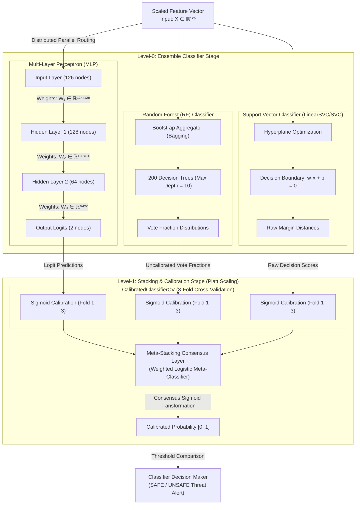

# LLMSCAN: Real-Time Activation Intervention & Misbehavior Detection

[](https://www.python.org/)
[](https://pytorch.org/)
[](https://fastapi.tiangolo.com/)
[](https://nextjs.org/)
[](https://www.mongodb.com/)
[](https://streamlit.io/)

**LLMSCAN** is an advanced explainable AI safety framework designed for real-time internal causal auditing of Large Language Models. Instead of treating the target model as a black box, LLMSCAN intercepts the internal layers of a quantized **Mistral-7B-Instruct-v0.2** model during runtime inference. By executing layer-level and token-level causal interventions, the framework extracts statistical features and classifies inputs into security threat categories using a stacked ensemble classifier.

---

## 🌟 Key Features

- **White-Box Activation Hooking**: Direct interception of intermediate layers using PyTorch forward hooks.
- **Activation Intervention Evaluation (AIE)**:
  - **Layer Interventions**: Measures causal importance per layer via logit-difference analysis.
  - **Token Interventions**: Quantifies token-level causal weights by iteratively replacing prompt tokens with neutral masks.
- **Stacked Ensemble Threat Classifier**: Utilizes low-dimensional causal features to classify prompt behavior into **Jailbreak, Bias, Lies, Toxic, and Backdoor** using a combined Multi-Layer Perceptron (MLP), Random Forest, and Support Vector Classifier (SVC).
- **Interactive Multi-Interface Dashboard**:
  - **Next.js Web App**: Modern dashboard showing session logs, user histories, chat tracking, and premium 3D graphics (NextAuth + Spline).
  - **Streamlit Analytics Dashboard**: Standalone dashboard plotting interactive matplotlib charts of token-level and layer-wise causal effects in real-time.
- **MongoDB Logging**: Persistent logging of user chats, generated text, raw causal weights, and threat assessments.

---

## 📊 Conceptual Architecture

```
                    +---------------------------------------+
                    |           Next.js Frontend            |
                    | (Session Logs, UI, Spline 3D Graphics)|
                    +-------------------+-------------------+
                                        |
                              HTTP POST  |  /scan Request
                                        v
                    +---------------------------------------+
                    |            FastAPI Backend            |
                    |   (Authentication, MongoDB Logger)    |
                    +-------------------+-------------------+
                                        |
                           Local Call    |  full_scan()
                                        v
                    +---------------------------------------+
                    |          MistralScanner Engine        |
                    |  (Quantized Mistral-7B PyTorch Model) |
                    +---------+-------------------+---------+
                               |                   |
                PyTorch Hooks  |                   |  Token Intervention
                               /                   \
                              v                     v
                    +-------------------+   +-------------------+
                    |   Layer AIE Scan  |   |  Prompt AIE Scan  |
                    | (Logit-Difference)|   |  (Token Masking)  |
                    +---------+---------+   +---------+---------+
                               |                       |
                  Slice [10:31]|                       | Causal Weights
                               v                       v
                               |             +---------v---------+
                               |             |    Statistical    |
                               |             | Feature Extractor |
                               |             +---------+---------+
                               |                       |
                               |                       | 5 Stats
                               +-----------+-----------+
                                           |
                                           v (AIE Slice + Stats Vector)
                    +---------------------+---------------------+
                    |       Ensemble Threat Classifier          |
                    |   (Stacked MLP + Random Forest + SVC)     |
                    +---------------------+---------------------+
                                          |
                                          v (Class Probabilities)
                    +---------------------+---------------------+
                    |       Dashboard Visualization Layer       |
                    |   (MongoDB Record, Next.js / Streamlit)   |
                    +-------------------------------------------+
```

---

## 🤖 Stacked Ensemble Classifier & Calibration

### **Detailed Visual Architecture (Level-0 & Level-1)**



### **Base Classifiers Technical Specifications**

| Base Classifier (Level-0) | Inputs | Optimizer / Solvers | Parameters & Architecture Details | Estimated Parameter Count |
| :--- | :--- | :--- | :--- | :--- |
| **Multi-Layer Perceptron (MLP)** | $X \in \mathbb{R}^{126}$ | **Adam** (Adaptive Moment Estimation) | 3-Layer Dense Network (126 → 128 → 64 → 2), ReLU activation, cross-entropy minimization with backpropagation. | **24,642** weights & biases |
| **Random Forest (RF)** | $X \in \mathbb{R}^{126}$ | **Bootstrap Aggregator (Bagging)** | 200 Decision Trees, Max Depth: 10, Min Split: 5. Split optimization using Gini Impurity. | ~**204,600** split thresholds |
| **Support Vector Classifier (SVC)** | $X \in \mathbb{R}^{126}$ | **Sequential Minimal Optimization (SMO)** | Separating Hyperplane boundary: $w \cdot x + b = 0$, RBF or Linear kernel. Minimizes Hinge loss. | **127** coefficients + Support Vectors |

### **Mathematical Execution Formulations**

* **SyncLayer-0 Forward Pass (MLP Example)**:
  $$\mathbf{z} = \mathbf{W}_3 \cdot \text{ReLU}(\mathbf{W}_2 \cdot \text{ReLU}(\mathbf{W}_1 \mathbf{x} + \mathbf{b}_1) + \mathbf{b}_2) + \mathbf{b}_3$$

* **Level-1 Sigmoid Calibration Calibration**:
  $$P(y = 1 \mid f(\mathbf{x})) = \frac{1}{1 + \exp(A \cdot f(\mathbf{x}) + B)}$$

* **Level-1 Consensus Stacking**:
  $$\text{Consensus Probability} = \sigma\left( \sum_{m \in \{MLP, RF, SVC\}} w_m \cdot P_m(y=1 \mid \mathbf{x}) + b_{meta} \right)$$

### **Stacking & Calibration Mechanics (Level-1)**

1. **Why Calibration is Required**: Base models do not inherently output true probabilities. SVC outputs unconstrained hyperplane distances ($[-&infin;, +&infin;]$), while Random Forest outputs decision tree vote fractions.
2. **Platt Scaling (Calibration)**: To solve this, base outputs are transformed using Platt Scaling via `CalibratedClassifierCV(cv=3, method='sigmoid')` to output true probabilities:
   $$P(y = 1 \mid f(\mathbf{x})) = \frac{1}{1 + \exp(A \cdot f(\mathbf{x}) + B)}$$
   Sigmoid calibration parameters $A$ and $B$ are fitted using Maximum Likelihood Estimation over 3 cross-validation partitions.
3. **Consensus Stacking**: The calibrated probabilities are combined using a consensus meta-estimator (weighted consensus layer) to produce the final classification score.
4. **Custom Category Decision Thresholds**:
   - **Jailbreak**: Threshold $\ge 0.90$
   - **Bias**: Threshold $\ge 0.85$
   - **Lies (Hallucination)**: Threshold $\ge 0.98$
   - **Toxic**: Threshold $\ge 0.85$
   - **Backdoor**: Threshold $\ge 0.90$
   - **Length Override**: Prompts with length $< 5$ characters are forced to `SAFE`.

---

## 📁 Repository Structure

```
.
├── Source code/
│   ├── backend/
│   │   ├── auth.py              # User authentication and JWT management
│   │   ├── database.py          # MongoDB async driver configuration (Motor)
│   │   ├── main.py              # FastAPI server backend configuration
│   │   ├── model.py             # MistralScanner core logic & hooks registration
│   │   └── schemas.py           # Pydantic data validation schemas
│   ├── frontend/                # Next.js 15 Web Application
│   │   ├── src/                 # UI Components, layouts, pages, and hooks
│   │   ├── package.json         # Node.js dependencies configuration
│   │   └── tailwind.config.ts   # Styling tokens & Tailwind configuration
│   ├── streamlit_app.py         # Streamlit Analytics Dashboard
│   ├── requirements.txt         # Python backend dependencies
│   └── BTech_Project_Report.md  # Detailed Academic Project Report
├── data/                        # Datasets (BBQ, GCG, PAP, Badnet, etc.)
├── Screenshots/                 # UI Visuals & Dashboard screenshots
└── README.md                    # This document
```

---

## 🛠️ Prerequisites & Setup

### Requirements
- **Python**: v3.10+
- **Node.js**: v18+
- **MongoDB**: Active local instance running on `mongodb://localhost:27017/`
- **GPU Acceleration**: CUDA toolkit 11.8/12.1+ (Recommended with 12GB+ VRAM)

---

### Step 1: Clone the Repository
```bash
git clone https://github.com/shamakurasaitejagoud/LLM-Scan-for-misbehaviour-detection.git
cd LLM-Scan-for-misbehaviour-detection
```

### Step 2: Setup Python Backend & Streamlit
1. Navigate to the Source Code directory:
   ```bash
   cd "Source code"
   ```
2. Create and activate a Python virtual environment:
   ```bash
   python -m venv venv
   # On Windows:
   .\venv\Scripts\activate
   # On Linux/macOS:
   source venv/bin/activate
   ```
3. Install required packages:
   ```bash
   pip install -r requirements.txt
   ```
4. Create a `.env` file inside the `backend` folder:
   ```env
   NEXTAUTH_SECRET="your-next-auth-secret-key"
   MONGODB_URI="mongodb://localhost:27017/llmscan"
   ```
5. Launch the FastAPI server:
   ```bash
   python backend/main.py
   ```
6. (In a separate terminal session) Start the Streamlit Analytics dashboard:
   ```bash
   streamlit run streamlit_app.py
   ```

### Step 3: Setup Next.js Frontend
1. Navigate to the frontend directory:
   ```bash
   cd frontend
   ```
2. Install npm packages:
   ```bash
   npm install
   ```
3. Configure your local `.env` variables (e.g. Google OAuth settings, next-auth setup, FastAPI endpoint references).
4. Run the Next.js development server:
   ```bash
   npm run dev
   ```

Open your browser and navigate to `http://localhost:3000` to interact with the platform.

---

